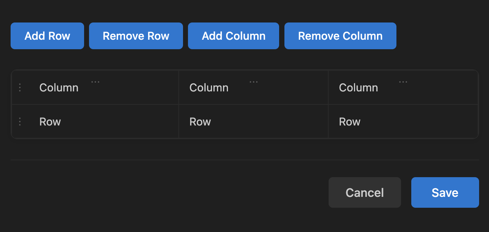

# Better Markdown Tables

An interactive editor for Markdown tables. The extension handles all the tedious aspects of markdown table formatting, letting you focus on your content rather than syntax.

- **Visual Table Editor**: Edit tables in a user-friendly interface
- **Create New Tables**: Generate tables from scratch with customizable dimensions
- **Row/Column Management**: Add, remove, and manipulate table structure
- **Drag & Drop**: Reorder rows and columns with intuitive drag-and-drop
- **Smart Formatting**: Automatically formats tables with proper alignment
- **CodeLens Integration**: Quick "Edit" buttons appear above existing tables

## Usage

### Creating a New Table

1. Open a Markdown (`.m`d) or MDX (`.mdx`) file
2. Position your cursor where you want to add the table
3. Command Palette: `Ctrl+Shift+P` → "Markdown Tables: Create Table"

### Editing Existing Tables

1. Navigate to any markdown table in your file
2. Click the "Edit" button that appears above the table
3. The interactive editor will open with your table data

## Installation

- [VS Code Marketplace](https://marketplace.visualstudio.com/items?itemName=jurajstefanic.better-markdown-tables)
